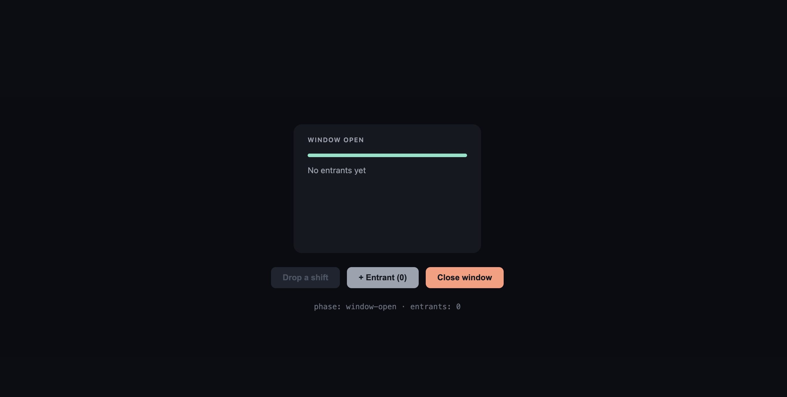

# ShiftFair

**Real-time shift drop cards for warehouse flexible workers.**

[](https://react.dev)
[](https://www.typescriptlang.org)
[](https://vite.dev)
[](https://rive.app)
[](https://shiftfair.vercel.app)
[](https://github.com/SidakMann/shiftfair/actions/workflows/ci.yml)

**[Live demo → shiftfair.vercel.app](https://shiftfair.vercel.app)**



---

## The Problem

Warehouses run on flexible labour. On any given day a manager needs to fill a shift gap, so they drop it in a WhatsApp group and wait. Workers miss the message, reply too late, or never know whether they got it. The manager chases individually. Nobody has real-time visibility into demand.

The outcome: shifts go unfilled, workers miss earning opportunities they actually wanted, and the whole process runs through a chat thread never designed for scheduling.

ShiftFair solves this with a single UI component — the **shift drop card** — that manages the full lifecycle of one shift from the moment it is posted to the moment it is filled or expires.

---

## How It Works

A shift moves through five states, each with a distinct visual:

```
Posted  ──[drop]──►  Window Open  ──[close]──►  Allocating
                          │                           │
                     progress bar                entrantCount
                       fills live                     │
                                              ┌────────┴────────┐
                                           Awarded           Expired
                                          (teal, 1.5s)   (orange, 1.5s)
                                                    └──────┘
                                                    auto-reset to Posted
```

| State | What the worker sees |
|---|---|
| **Posted** | Shift is live. Drop window not yet open. |
| **Window open** | A teal progress bar counts down the window. Entrant count updates live. |
| **Allocating** | Window closed. System is selecting. |
| **Awarded** | Large teal "Awarded" — someone got it. Resets in 1.5 s. |
| **Expired** | Large orange "Expired" — nobody available. Resets in 1.5 s. |

---

## Tech Stack

| Layer | Technology | Why |
|---|---|---|
| UI framework | React 19 | Component state drives every phase transition |
| Language | TypeScript 5.8 strict | `Phase` union type makes illegal states unrepresentable |
| Bundler | Vite 7 | Sub-second HMR during development |
| Animation runtime | Rive + `@rive-app/react-canvas` | State machine (`ShiftMachine`) mirrors React phases; ready for native Rive visuals |
| Compiler | React Compiler (Babel plugin) | Auto-memoization — no manual `useMemo` / `useCallback` |
| Hosting | Vercel | Zero-config deploy from `dist/` |

---

## Local Development

```bash
git clone https://github.com/SidakMann/shiftfair.git
cd shiftfair/client
npm install
npm run dev          # → http://localhost:5173
```

Build for production:

```bash
npm run build        # tsc + vite build → dist/
```

---

## Project Structure

```
shiftfair/
├── client/                      # Vite + React app
│   ├── public/
│   │   └── shift.riv            # Rive file: ShiftMachine (7 transitions, 3 inputs)
│   └── src/
│       ├── ShiftCard.tsx        # Main component — Rive SM + React visual layer
│       ├── ShiftCardCSS.tsx     # Pure CSS fallback (no Rive dependency)
│       ├── App.tsx
│       └── index.css
└── README.md
```

---

## Architecture

The component runs as two stacked layers inside a `320 × 220` card:

**Layer 1 — Rive state machine**
The `.riv` file runs `ShiftMachine` in the background. It receives three inputs from React:

- `dropShift` (trigger) — fires when the shift window opens
- `closeWindow` (trigger) — fires when the window is closed
- `entrantCount` (number) — updated as workers express interest

**Layer 2 — React visual overlay**
All visible content is driven by React state (`phase`, `progress`, `displayCount`). CSS transitions handle opacity fades and the progress bar fill. React is the single source of truth.

This split means the card works correctly right now, and the Rive visual layer can be built out in the Rive editor independently — without touching any React code.

---

## Rive State Machine

```
Entry → Posted
Posted       → WindowOpen    (dropShift trigger)
WindowOpen   → Allocating    (closeWindow trigger)
Allocating   → Awarded       (entrantCount > 0)
Allocating   → Expired       (entrantCount == 0)
Awarded      → Posted        (exit time: 1500 ms)
Expired      → Posted        (exit time: 1500 ms)
```

---

## Roadmap

- [ ] Build Rive visual hierarchy in the editor (Card, ProgressBar, EntrantCount, Winner text)
- [ ] Add ShiftVM ViewModel with `windowProgress`, `entrantCount`, `winnerColor` properties
- [ ] Data-bind Fill width → `windowProgress`; Winner text → `winnerColor`
- [ ] Connect to a real backend — WebSocket push when a shift is dropped
- [ ] Multi-card view — show all active shifts simultaneously
- [ ] Worker identity — show who is competing for the same shift

---

## License

MIT
